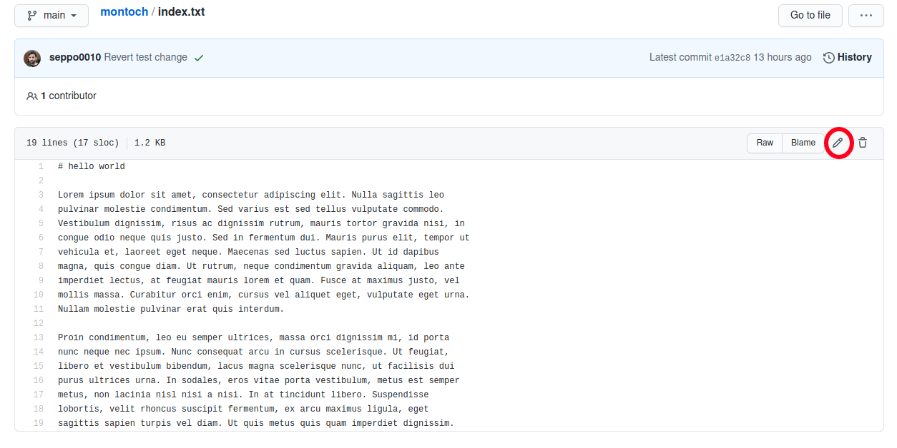
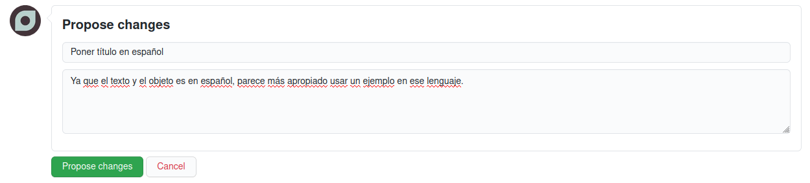
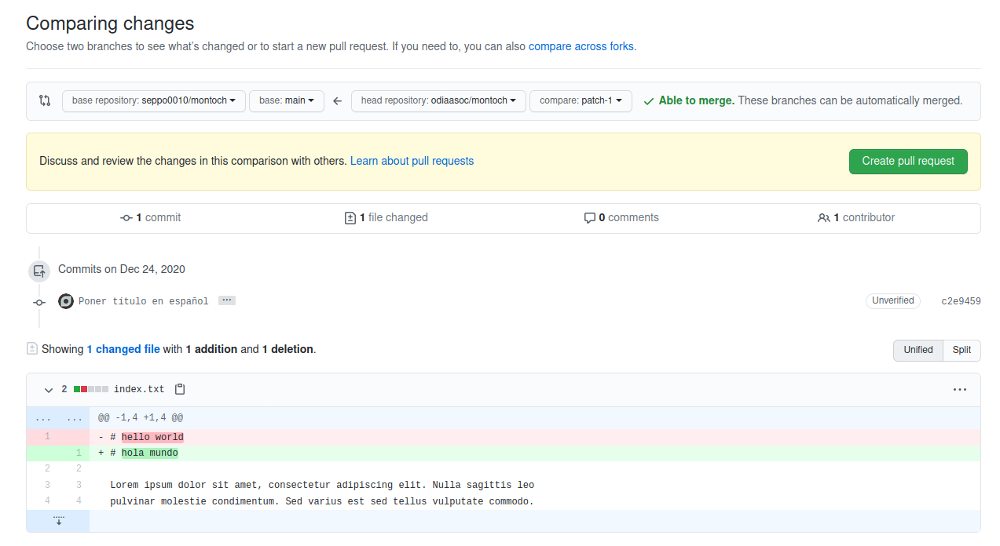
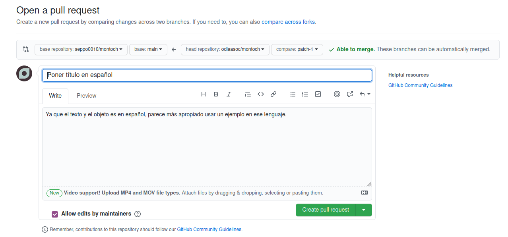
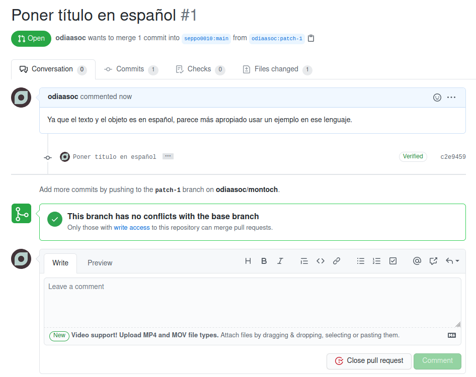

# montoch

Colaboración documental vía github.

## Cómo empezar

Primero hay que crear una cuenta en GitHub. Se recomienda también habilitar la
autenticación de dos factores.

Después, dentro de este repositorio va a haber una lista de archivos. Haciendo
click en uno de ellos (por ejemplo, `index.txt`), se puede ver su contenido.

La forma de hacer modificaciones es a través de "sugerencias" (llamadas _pull
requests_). Para crear una debemos tocar en el lapiz a la derecha

Ahora vamos a poder editarlo. Podemos por ejemplo cambiar `hello world` para
que diga `hola mundo`, y abajo nos pide un título y descripción para nuestra
propuesta. Podemos por ejemplo completar "Poner título en español" y "Ya que el
texto y el objeto es en español, parece más apropiado usar un ejemplo en ese
lenguaje" y tocamos el botón verde para enviar.

Todavía nuestra propuesta no se formalizó. Hasta acá creamos una copia del
archivo y le aplicamos nuestro cambio, pero no lo enviamos para que sea
incorporado. En la pantalla actual veremos los cambios que hicimos y si nos
parece bien podemos crear la propuesta con el botón verde de nuevo.

Luego tenemos una última pantalla de confirmación (sí, en serio).

Y finalmente hemos creado nuestro primer _pull request_.

Ahora le corresponde a quien administra el documento de incorporarlo o pedir
sucesivas modificaciones.

Si queremos hacer nuevos cambios podemos ir a _archivos modificados_ y desde
los puntos suspensivos editar nuevamente.
